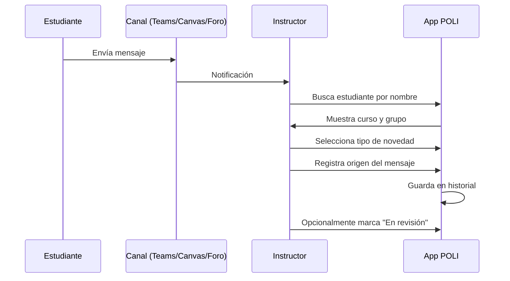

# 📋 Diseño de Sistema de Novedades - Sección Inicio

**Fecha**: 2025-12-19  
**Objetivo**: Rediseñar la sección Inicio como panel de control para registro de novedades de estudiantes  
**Problema a resolver**: Registrar situaciones como "estudiante trabaja solo" de forma rápida, intuitiva y con historial

---

## 1. ANÁLISIS DEL PROBLEMA

### 📌 Flujo de Trabajo del Instructor



### 📌 Requisitos Funcionales

1. **Búsqueda rápida** de estudiante por nombre
2. **Identificación automática** de curso y grupo
3. **Tipos de novedad predefinidos** (reutilizables):
   - "Trabaja solo"
   - "Ausente"
   - "Problema técnico"
   - "Conflicto de grupo"
   - (Personalizable)
4. **Origen del mensaje**:
   - Microsoft Teams
   - Canvas LMS (Mensajería)
   - Foro del curso
   - Email
   - Otro
5. **Estados de la novedad**:
   - ⏳ En revisión
   - ✅ Confirmado
   - ❌ Descartado
6. **Aplicación masiva** a varios estudiantes
7. **Historial** con filtros por curso, grupo, tipo, fecha

---

## 2. MODELO DE DATOS PROPUESTO

### 📊 Interfaces TypeScript

```typescript
// Tipo de novedad predefinido (reutilizable)
export interface TipoNovedad {
  id: string;
  nombre: string;           // "Trabaja solo"
  descripcion?: string;     // Descripción detallada para referencia
  icono: string;            // Ionicon name: "person-outline"
  color: string;            // Color de badge: "#ff9800"
  esRecurrente: boolean;    // Marca si es una situación común
  frecuenciaUso: number;    // Para ordenar por más usadas
  fechaCreacion: Date;
}

// Registro de novedad individual
export interface Novedad {
  id: string;
  estudianteCorreo: string;     // FK al estudiante
  estudianteNombre?: string;    // Cache para búsquedas rápidas
  cursoId: string;              // FK al curso
  grupo: string;                // Número de grupo
  
  tipoNovedadId: string;        // FK al tipo de novedad
  tipoNovedadNombre?: string;   // Cache
  
  origen: OrigenMensaje;
  descripcion?: string;         // Texto adicional opcional
  
  estado: EstadoNovedad;
  
  // Auditoría
  fechaRegistro: Date;
  fechaActualizacion?: Date;
  registradoPor?: string;       // ID del instructor
  
  // Para aplicación masiva
  grupoNovedadId?: string;      // Agrupa novedades registradas juntas
}

export type OrigenMensaje = 'teams' | 'canvas' | 'foro' | 'email' | 'presencial' | 'otro';

export type EstadoNovedad = 'en_revision' | 'confirmado' | 'descartado';

// Historial con metadatos
export interface HistorialNovedades {
  novedades: Novedad[];
  tiposUsados: TipoNovedad[];
  ultimaActualizacion: Date;
}
```

---

## 3. PROPUESTAS DE GUI

---

### 🅰️ OPCIÓN A: Panel de Acciones Rápidas (Quick Actions)

**Concepto**: Barra de búsqueda prominente + Panel flotante de registro

#### Desktop (>992px)

```
┌─────────────────────────────────────────────────────────────────────────┐
│  🔍 [Buscar estudiante por nombre...]     [📊 Estadísticas] [📋 Historial]│
├─────────────────────────────────────────────────────────────────────────┤
│                                                                         │
│  ┌──────────────────────────────┐  ┌──────────────────────────────────┐ │
│  │  📚 CURSOS                   │  │  📝 REGISTRO RÁPIDO              │ │
│  │  ┌───────────────────────┐   │  │                                  │ │
│  │  │ EPM-B01  ██████ 24 est│   │  │  Estudiantes seleccionados: 3   │ │
│  │  │  • Grupo 1 (5) ⚠️ 1    │   │  │  ┌──────────────────────────┐   │ │
│  │  │  • Grupo 2 (5) ✅      │   │  │  │ ✕ Juan Pérez (EPM G1)    │   │ │
│  │  │  • Grupo 3 (4)        │   │  │  │ ✕ María López (EPM G1)   │   │ │
│  │  │  • Grupo 4 (5)        │   │  │  │ ✕ Carlos Ruiz (SO G2)    │   │ │
│  │  │  • Grupo 5 (5)        │   │  │  └──────────────────────────┘   │ │
│  │  └───────────────────────┘   │  │                                  │ │
│  │                              │  │  Tipo de novedad:                │ │
│  │  ┌───────────────────────┐   │  │  ┌────────────────────────────┐  │ │
│  │  │ SO-B02   ████── 18 est│   │  │  │ 👤 Trabaja solo         ▼│  │ │
│  │  │  • Grupo 1 (4)        │   │  │  └────────────────────────────┘  │ │
│  │  │  • Grupo 2 (5)        │   │  │                                  │ │
│  │  │  • Grupo 3 (4)        │   │  │  Origen del mensaje:             │ │
│  │  │  • Grupo 4 (5)        │   │  │  ○ Teams  ● Canvas  ○ Foro      │ │
│  │  └───────────────────────┘   │  │  ○ Email  ○ Presencial          │ │
│  │                              │  │                                  │ │
│  └──────────────────────────────┘  │  Estado:                         │ │
│                                    │  ⏳ En revisión ○ ✅ Confirmado   │ │
│                                    │                                  │ │
│                                    │  [Cancelar]  [✓ Registrar (3)]   │ │
│                                    └──────────────────────────────────┘ │
│                                                                         │
└─────────────────────────────────────────────────────────────────────────┘
```

#### Tablet (768px - 991px)

```
┌────────────────────────────────────────────────────────────┐
│  🔍 [Buscar estudiante...]           [📊] [📋]             │
├────────────────────────────────────────────────────────────┤
│                                                            │
│  ┌─ CURSOS ───────────────────────────────────────────┐   │
│  │  EPM-B01 ████  │  SO-B02 ███─  │  BD-B05 ██──      │   │
│  └────────────────────────────────────────────────────┘   │
│                                                            │
│  ┌─ GRUPOS CURSO ACTIVO ──────────────────────────────┐   │
│  │  [ 1 • 5 ] [ 2 • 5 ] [ 3 • 4 ⚠️] [ 4 • 5 ] [ 5 • 5 ] │   │
│  └────────────────────────────────────────────────────┘   │
│                                                            │
│  ┌─ REGISTRO RÁPIDO ──────────────────────────────────┐   │
│  │  (Panel deslizante desde abajo o lateral)          │   │
│  │  ...contenido similar al desktop...                │   │
│  └────────────────────────────────────────────────────┘   │
│                                                            │
└────────────────────────────────────────────────────────────┘
```

#### Mobile (<768px)

```
┌────────────────────────────────┐
│  🔍 Buscar estudiante...       │
├────────────────────────────────┤
│                                │
│  ┌─ CURSOS ─────────────────┐  │
│  │ [EPM] [SO] [BD] →        │  │
│  └──────────────────────────┘  │
│                                │
│  📊 Resumen: 42 estudiantes    │
│  ⚠️ 3 novedades pendientes     │
│                                │
│  ┌─ GRUPOS EPM ─────────────┐  │
│  │  ┌───┐ ┌───┐ ┌───┐       │  │
│  │  │ 1 │ │ 2 │ │3⚠️│ →     │  │
│  │  │ 5 │ │ 5 │ │ 4 │       │  │
│  │  └───┘ └───┘ └───┘       │  │
│  └──────────────────────────┘  │
│                                │
│  ┌─ ÚLTIMAS NOVEDADES ──────┐  │
│  │ • Juan Pérez - Trabaja   │  │
│  │   solo (hace 2h) ⏳       │  │
│  │                          │  │
│  │ • María López - Ausente  │  │
│  │   (ayer) ✅               │  │
│  └──────────────────────────┘  │
│                                │
│           ＋ FAB               │
│      (Abre modal registro)     │
└────────────────────────────────┘
```

**Pros**:
- ✅ Flujo natural: buscar → seleccionar → registrar
- ✅ Panel de registro siempre visible (desktop)
- ✅ Selección múltiple para registro masivo
- ✅ Vista de todos los cursos simultánea

**Contras**:
- ⚠️ Requiere espacio horizontal
- ⚠️ En móvil necesita modal adicional

---

### 🅱️ OPCIÓN B: Formulario Modal (Form-First)

**Concepto**: Botón prominente que abre modal paso a paso

#### Desktop

```
┌─────────────────────────────────────────────────────────────────────────┐
│  [📍 Vista General]  [EPM-B01]  [SO-B02]  [BD-B05]     [+ Nueva Novedad]│
├─────────────────────────────────────────────────────────────────────────┤
│                                                                         │
│  ┌─ PANORAMA GENERAL ───────────────────────────────────────────────┐  │
│  │                                                                   │  │
│  │  ┌───────────────┐  ┌───────────────┐  ┌───────────────┐        │  │
│  │  │  📚 Cursos    │  │  👥 Estudiantes│  │  ⚠️ Novedades  │        │  │
│  │  │     3        │  │      67       │  │      8        │        │  │
│  │  │              │  │              │  │ (5 pendientes) │        │  │
│  │  └───────────────┘  └───────────────┘  └───────────────┘        │  │
│  │                                                                   │  │
│  │  ┌─ DISTRIBUCIÓN POR ESTADO ────────────────────────────────┐   │  │
│  │  │  ✅ OK: 54  │  👤 Solos: 8  │  ❌ Ausentes: 3  │  ⏳ Rev: 2 │   │  │
│  │  └───────────────────────────────────────────────────────────┘   │  │
│  │                                                                   │  │
│  │  ┌─ NOVEDADES RECIENTES ─────────────────────────────────────┐   │  │
│  │  │  Hoy:                                                      │   │  │
│  │  │  • 14:30 - Juan Pérez (EPM G1) - Trabaja solo ⏳           │   │  │
│  │  │  • 11:15 - María López (SO G3) - Conflicto grupo ✅        │   │  │
│  │  │                                                            │   │  │
│  │  │  Ayer:                                                     │   │  │
│  │  │  • 16:45 - Carlos Ruiz (EPM G2) - Ausente ✅               │   │  │
│  │  └───────────────────────────────────────────────────────────┘   │  │
│  │                                                                   │  │
│  └───────────────────────────────────────────────────────────────────┘  │
│                                                                         │
└─────────────────────────────────────────────────────────────────────────┘
```

#### Modal de Registro (ambas plataformas)

```
┌──────────────────────────────────────────────────────────────┐
│  ╳                   REGISTRAR NOVEDAD                       │
├──────────────────────────────────────────────────────────────┤
│                                                              │
│  PASO 1: Identificar Estudiante(s)                           │
│  ───────────────────────────────────────────────────────────│
│  🔍 [Buscar por nombre, correo o ID...]                     │
│                                                              │
│  Resultados:                                                 │
│  ┌────────────────────────────────────────────────────────┐ │
│  │ ☑ Juan Pérez García    │ EPM-B01 │ Grupo 1 │           │ │
│  │ ☐ Juan Pérez Martínez  │ SO-B02  │ Grupo 3 │           │ │
│  └────────────────────────────────────────────────────────┘ │
│                                                              │
│  PASO 2: Tipo de Novedad                                     │
│  ───────────────────────────────────────────────────────────│
│  ┌──────────────────────────────────────────────────────┐   │
│  │ ⭐ USADOS FRECUENTEMENTE                             │   │
│  │  [👤 Trabaja solo] [❌ Ausente] [⚠️ Problema técnico] │   │
│  │                                                       │   │
│  │ ➕ OTROS                                              │   │
│  │  [🔄 Conflicto grupo] [📝 Observación] [+ Nuevo]     │   │
│  └──────────────────────────────────────────────────────┘   │
│                                                              │
│  PASO 3: Detalles                                            │
│  ───────────────────────────────────────────────────────────│
│  Origen del mensaje:                                         │
│  [📱 Teams] [📧 Canvas] [💬 Foro] [✉️ Email] [👁 Presencial] │
│                                                              │
│  Estado inicial:                                             │
│  (●) ⏳ En revisión   ( ) ✅ Confirmado                      │
│                                                              │
│  Nota adicional (opcional):                                  │
│  ┌────────────────────────────────────────────────────────┐ │
│  │ Estudiante indica que compañeros no responden...      │ │
│  └────────────────────────────────────────────────────────┘ │
│                                                              │
├──────────────────────────────────────────────────────────────┤
│                          [Cancelar]  [✓ Registrar Novedad]   │
└──────────────────────────────────────────────────────────────┘
```

**Pros**:
- ✅ Flujo guiado paso a paso
- ✅ Mismo modal funciona en todas las plataformas
- ✅ Vista general clara sin elementos de edición
- ✅ Fácil de extender con más pasos

**Contras**:
- ⚠️ Requiere más clics (abrir modal)
- ⚠️ Contexto se pierde al abrir modal
- ⚠️ Menos eficiente para registros múltiples rápidos

---

### 🅲️ OPCIÓN C: Editor Inline de Cards (Card-First)

**Concepto**: Cada grupo es una card editable con modo de registro

#### Desktop

```
┌─────────────────────────────────────────────────────────────────────────┐
│  🔍 [Buscar...]    [📍 Todos]  [EPM-B01]  [SO-B02]      [⚙️] [📊]       │
├─────────────────────────────────────────────────────────────────────────┤
│                                                                         │
│  ┌─────────────────────────────────────────────────────────────────┐   │
│  │  EPM-B01: PROGRAMACIÓN MÓVIL                    ⚠️ 2 novedades   │   │
│  ├─────────────────────────────────────────────────────────────────┤   │
│  │                                                                 │   │
│  │  ┌─ Grupo 1 ──────────────────────────────────────────────────┐│   │
│  │  │ 👤 Juan Pérez      [⏳ Trabaja solo - Teams]  ✏️           ││   │
│  │  │ 👤 María López     [✅ OK]                                 ││   │
│  │  │ 👤 Carlos Ruiz     [✅ OK]                                 ││   │
│  │  │ 👤 Ana García      [✅ OK]                                 ││   │
│  │  │ 👤 Pedro Sánchez   [❓ Sin estado]          [+ Registrar]  ││   │
│  │  └────────────────────────────────────────────────────────────┘│   │
│  │                                                                 │   │
│  │  ┌─ Grupo 2 (Colapsado) ───────────── 5 integrantes, 0 nov ──┐│   │
│  │  └────────────────────────────────────────────────────────────┘│   │
│  │                                                                 │   │
│  │  ┌─ Grupo 3 ──────────────────────────────────────────────────┐│   │
│  │  │ 👤 Luis Hernández  [⏳ Ausente - Foro]       ✏️            ││   │
│  │  │ 👤 Rosa Martínez   [✅ OK]                                 ││   │
│  │  │ ...                                                        ││   │
│  │  └────────────────────────────────────────────────────────────┘│   │
│  │                                                                 │   │
│  └─────────────────────────────────────────────────────────────────┘   │
│                                                                         │
└─────────────────────────────────────────────────────────────────────────┘
```

#### Modo de Registro Inline (al hacer clic en estudiante)

```
┌────────────────────────────────────────────────────────────────────────┐
│  👤 Pedro Sánchez                                         ✕ Cerrar    │
├────────────────────────────────────────────────────────────────────────┤
│                                                                        │
│  Curso: EPM-B01  │  Grupo: 1  │  Correo: pedro.sanchez@poli.edu.co   │
│                                                                        │
│  ┌─ REGISTRAR NOVEDAD ───────────────────────────────────────────────┐│
│  │                                                                   ││
│  │  Tipo: [👤 Trabaja solo ▼]                                       ││
│  │                                                                   ││
│  │  Origen: [Teams ▼]     Estado: [⏳ En revisión ▼]                ││
│  │                                                                   ││
│  │  Nota: [_________________________________]                        ││
│  │                                                                   ││
│  │                              [Cancelar]  [✓ Guardar]              ││
│  │                                                                   ││
│  └───────────────────────────────────────────────────────────────────┘│
│                                                                        │
│  ┌─ HISTORIAL ───────────────────────────────────────────────────────┐│
│  │  (Sin novedades registradas)                                      ││
│  └───────────────────────────────────────────────────────────────────┘│
│                                                                        │
└────────────────────────────────────────────────────────────────────────┘
```

**Pros**:
- ✅ Contexto siempre visible
- ✅ Registro desde cualquier punto
- ✅ Ver estado de todo el grupo de un vistazo
- ✅ Historial del estudiante inline

**Contras**:
- ⚠️ Puede resultar muy cargado visualmente
- ⚠️ Difícil de escalar con muchos cursos
- ⚠️ Registro masivo menos intuitivo

---

## 4. COMPARACIÓN DE OPCIONES

| Criterio | Opción A | Opción B | Opción C |
|----------|:--------:|:--------:|:--------:|
| **Registro rápido desde búsqueda** | ⭐⭐⭐ | ⭐⭐ | ⭐⭐ |
| **Registro masivo** | ⭐⭐⭐ | ⭐⭐ | ⭐ |
| **Vista panorámica** | ⭐⭐ | ⭐⭐⭐ | ⭐⭐ |
| **Contexto del estudiante** | ⭐⭐ | ⭐ | ⭐⭐⭐ |
| **Adaptación móvil** | ⭐⭐ | ⭐⭐⭐ | ⭐ |
| **Complejidad de implementación** | Media | Baja | Alta |
| **Escalabilidad (muchos cursos)** | ⭐⭐⭐ | ⭐⭐⭐ | ⭐ |

---

## 5. RECOMENDACIÓN INICIAL

### 🏆 Opción Híbrida: A + B

Combinar lo mejor de ambas opciones:

1. **Pantalla principal**: Opción A (búsqueda + panel lateral)
2. **Registro detallado**: Modal de Opción B (para casos complejos)
3. **Registro rápido**: Sistema de chips/badges de Opción A

```
┌─────────────────────────────────────────────────────────────────────────┐
│  🔍 [Buscar estudiante...]                                [📊] [📋]    │
├─────────────────────────────────────────────────────────────────────────┤
│                                                                         │
│  ┌─ CURSOS ─────────────────────────────────────────────────────────┐  │
│  │  ┌───────────┐  ┌───────────┐  ┌───────────┐                     │  │
│  │  │  EPM-B01  │  │  SO-B02   │  │  BD-B05   │                     │  │
│  │  │  24 est   │  │  18 est   │  │  25 est   │                     │  │
│  │  │  ⚠️ 2 nov  │  │  ✅ 0 nov  │  │  ⚠️ 1 nov  │                     │  │
│  │  └───────────┘  └───────────┘  └───────────┘                     │  │
│  └──────────────────────────────────────────────────────────────────┘  │
│                                                                         │
│  ┌─ NOVEDADES PENDIENTES ────────────────────────────────────────────┐ │
│  │                                                                    │ │
│  │  ⏳ Juan Pérez (EPM G1) - Trabaja solo           [✓] [✗] [✏️]     │ │
│  │  ⏳ María López (EPM G3) - Ausente               [✓] [✗] [✏️]     │ │
│  │  ⏳ Carlos Ruiz (BD G2) - Problema técnico       [✓] [✗] [✏️]     │ │
│  │                                                                    │ │
│  └────────────────────────────────────────────────────────────────────┘ │
│                                                                         │
│  ┌─ REGISTRO RÁPIDO ─────────────────────────────────────────────────┐ │
│  │  Estudiantes: [ Juan Pérez ✕ ] [ María López ✕ ]                  │ │
│  │  Tipo: [👤 Trabaja solo ▼]  Origen: [Teams ▼]  [+ Registrar]      │ │
│  └────────────────────────────────────────────────────────────────────┘ │
│                                                                         │
│                                              [+ Nueva Novedad Detallada]│
└─────────────────────────────────────────────────────────────────────────┘
```

---

## 6. DISEÑO MOBILE (Híbrido A+B)

```
┌────────────────────────────────┐
│  🔍 Buscar...            ≡    │
├────────────────────────────────┤
│                                │
│  ⚠️ 3 novedades pendientes     │
│  ─────────────────────────────│
│  ┌──────────────────────────┐  │
│  │ 👤 Juan Pérez            │  │
│  │    EPM G1 • Trabaja solo │  │
│  │    ⏳ En revisión        │  │
│  │         [✓ OK] [✗ Desc.] │  │
│  └──────────────────────────┘  │
│  ┌──────────────────────────┐  │
│  │ 👤 María López           │  │
│  │    EPM G3 • Ausente      │  │
│  │    ⏳ En revisión        │  │
│  │         [✓ OK] [✗ Desc.] │  │
│  └──────────────────────────┘  │
│                                │
│  ─────────────────────────────│
│  📚 CURSOS                     │
│  ┌─────┐ ┌─────┐ ┌─────┐      │
│  │ EPM │ │ SO  │ │ BD  │ →    │
│  │ ⚠️2  │ │ ✅  │ │ ⚠️1  │      │
│  └─────┘ └─────┘ └─────┘      │
│                                │
│                                │
│              ＋                │
│        (FAB para modal)        │
└────────────────────────────────┘
```

---

## 7. PATRONES DE DISEÑO APLICABLES

### Command Pattern (Refactoring Guru)

Para el registro de novedades, usar Command permite:
- **Desacoplar** la UI del servicio de datos
- **Historial de acciones** (undo/redo potencial)
- **Cola de operaciones** para sincronización offline

```typescript
// Comando base
interface NovedadCommand {
  execute(): Promise<void>;
  undo?(): Promise<void>;
}

// Comando concreto
class RegistrarNovedadCommand implements NovedadCommand {
  constructor(
    private novedadService: NovedadService,
    private novedad: Novedad
  ) {}
  
  async execute(): Promise<void> {
    await this.novedadService.registrar(this.novedad);
  }
  
  async undo(): Promise<void> {
    await this.novedadService.eliminar(this.novedad.id);
  }
}

// Invoker
class NovedadInvoker {
  private history: NovedadCommand[] = [];
  
  async executeCommand(command: NovedadCommand): Promise<void> {
    await command.execute();
    this.history.push(command);
  }
  
  async undoLast(): Promise<void> {
    const command = this.history.pop();
    if (command?.undo) {
      await command.undo();
    }
  }
}
```

### Memento Pattern

Para el estado "En revisión" que puede revertirse:

```typescript
interface NovedadMemento {
  estado: EstadoNovedad;
  timestamp: Date;
}

class NovedadCaretaker {
  private mementos: Map<string, NovedadMemento[]> = new Map();
  
  save(novedadId: string, memento: NovedadMemento): void {
    if (!this.mementos.has(novedadId)) {
      this.mementos.set(novedadId, []);
    }
    this.mementos.get(novedadId)!.push(memento);
  }
  
  restore(novedadId: string): NovedadMemento | undefined {
    return this.mementos.get(novedadId)?.pop();
  }
}
```

---

## 8. PRÓXIMOS PASOS

### Fase 1: Validación de diseño
1. Revisar las 3 opciones de GUI
2. Decidir enfoque (A, B, C o Híbrido)
3. Ajustar diseños según feedback

### Fase 2: Modelo de datos
1. Crear interfaces TypeScript
2. Definir el servicio `NovedadService`
3. Integrar con storage existente

### Fase 3: Implementación UI
1. Crear componentes base
2. Implementar flujo de búsqueda
3. Implementar registro rápido
4. Implementar modal detallado

### Fase 4: Testing
1. Tests unitarios del servicio
2. Tests E2E del flujo de registro
3. Pruebas de usabilidad

---

## ❓ PREGUNTAS PARA DECISIÓN

1. **¿Cuál opción de GUI prefieres?** (A, B, C o Híbrido)

2. **¿Los tipos de novedad deben ser personalizables** por el instructor, o un catálogo fijo es suficiente?

3. **¿Se necesita exportar el historial** a Excel/PDF?

4. **¿Debe funcionar offline** (registrar sin conexión y sincronizar después)?

5. **¿Debe integrarse con notificaciones** (recordatorios de novedades pendientes de confirmar)?
